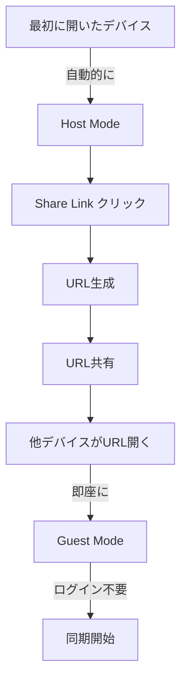

# SyncSlate AI 完全仕様書

> **オーナーREADMEに基づく正式仕様** - この文書はREADMEの内容を漏れなく構造化したものです。

## 📌 製品定義

**SyncSlate AI** は、映画製作者、コンテンツクリエイター、ボイスオーバーアーティスト向けのプロフェッショナルなブラウザベースのデジタルスレート・ショットタイミングツールです。

### 核心価値提案
- Google Gemini AIによる音声合成
- ゼロレイテンシ同期システム
- マルチデバイススタジオセットアップ対応
- **専用ハードウェア不要**

## 🎯 機能仕様

### 1. Precision Timeline（精密タイムライン）
```yaml
仕様:
  - Duration: 設定可能な継続時間
  - Pre-roll: 設定可能な準備時間
  - 表示: ビジュアルカウントダウン
  実装: requestAnimationFrameベースの高精度タイマー
```

### 2. AI Voice Synthesis（AI音声合成）
```yaml
エンジン: Google Gemini 2.5 Flash
生成内容:
  - "Action": 監督の声での開始合図
  - "Cut": 終了合図
  - Numbers: カウントダウン数字
  - Custom text: カスタムテキスト
生成タイミング: オンザフライ（即座生成）
```

### 3. Smart Cues（スマートキュー）
```yaml
機能:
  - 特定タイムスタンプでテキスト表示
  - 特定タイムスタンプで音声再生
用途: スクリプト台詞、演出指示
```

### 4. Color Ranges（カラーレンジ）
```yaml
目的: タレントへの視覚的シグナル
実装:
  - Green: 開始シグナル
  - Red: 終了シグナル
  - Custom: 時間ベースの動的背景色変更
```

### 5. Guest Mode（ゲストモード）
```yaml
⚠️ 最重要仕様:
  - ログイン不要: 一切の認証なし
  - 即座アクセス: URLを開くだけ
  - 同期スレーブ: タブレット/電話が同期ディスプレイに
  - URL共有: リンク共有のみで参加可能
```

### 6. Permission Management（権限管理）
```yaml
機能:
  - Request Control: ゲストがホストに制御要求
  - Remote Management: リモートスレート管理
実装: BroadcastChannelでの権限リクエスト送信
```

### 7. Multi-Language Support（多言語対応）
```yaml
対応言語（自動検出）:
  - English（英語）
  - Japanese（日本語）
  - Chinese（中国語）
  - French（フランス語）
  - German（ドイツ語）
  - Italian（イタリア語）
  - Korean（韓国語）
  - Hindi（ヒンディー語）
```

## 🔄 共有と同期仕様

### 設計理念
**"SyncSlate is designed to be frictionless"**（摩擦のない体験）

### 動作フロー


### 同期プロトコル仕様

#### Zero-Latency Synchronization Architecture
```yaml
技術:
  - BroadcastChannel API
  - Time-Reference Synchronization

実装詳細:
  Absolute Time Reference (ATR):
    - 概念: "current time"のストリーミングではない
    - 方式: 未来のstartTime（UTC + バッファ）を一度送信
    - バッファ: SYNC_LATENCY_BUFFER_MS = 500ms

  Distributed Autonomous Execution:
    Host: "T=1000で開始する"と宣言
    Client:
      - T=950で受信
      - 50msローカル待機
      - T=1000で frame 0 レンダリング開始

  Resilience（耐障害性）:
    - 計算式: currentFrame = Date.now() - startTime
    - 特徴: ネットワーク遅延でタイマーがドリフトしない
    - 自動補正: フレームドロップ時も正確な絶対時間にスナップ
```

### メッセージプロトコル
```typescript
type SyncMessage =
  | { type: 'SYNC_STATE'; payload: {
      settings: Settings;
      smartCues: SmartCue[];
      colorRanges: ColorRange[]
    }}
  | { type: 'CMD_START'; payload: {
      startTime: number  // 絶対時間 Date.now()
    }}
  | { type: 'CMD_STOP'; payload: {
      manual: boolean
    }};
```

## 🔊 音声アーキテクチャ仕様（本番環境）

```yaml
Individual Generation（個別生成）:
  - 理由: 精度確保
  - 方式: カウントダウン音声を1つずつ生成

Lightweight Data（軽量データ）:
  - 形式: 小さなデータファイル
  - 目的: 負荷最小化

Pre-installed Voice（プリインストール音声）:
  - 技術: Gemini's Prebuilt Voice configuration
  - 効果: 高品質・一貫性のあるパフォーマンス
```

## 👤 使用方法仕様

### For Hosts（ホスト向け）
```
1. Duration と Pre-Roll を設定
2. Smart Cues を追加（スクリプト/演出指示）
3. "Load AI Voices" をクリック（Gemini で音声事前生成）
4. "START SLATE" を押す
```

### For Guests（ゲスト向け）
```
1. ホストから提供されたリンクを開く
2. "WAITING FOR HOST" が表示される
3. ホストが開始すると自動的に同期
4. Settings（歯車）アイコン → "Request Control"で制御要求
```

## 🎨 Client App 詳細仕様

### Core Philosophy（核心理念）
**"The Client App is a pure 'Render Node'"**
- **ゼロ状態権限**: 状態を一切持たない
- **厳密な表示**: ホストの状態を厳密に可視化
- **極限的軽量**: URL駆動、フェイルセーフ

### 実装要件

#### 1. No Configuration UI（設定UI禁止）
```yaml
削除対象:
  - すべてのスライダー
  - すべての入力フィールド
  - すべてのボタン
  - すべてのトグルスイッチ

ユーザー不可:
  - Duration変更
  - Pre-roll変更
  - Color変更

例外: フルスクリーンボタンのみ許可
```

#### 2. No Login / No Auth（認証完全不要）
```yaml
動作:
  - URL訪問で即座に初期化
  - BroadcastChannel('sync-slate-v1')をリッスン
  - 認証画面を一切表示しない
```

#### 3. Visual States（ビジュアル状態）

| 状態 | トリガー | 表示 | ビジュアル |
|------|----------|------|------------|
| **Standby (Idle)** | 初期状態 | "WAITING FOR SIGNAL" | 控えめ、プロ仕様、ダークモード |
| **Armed (Buffer)** | CMD_START受信 & Date.now() < startTime | "ARMED"/"STANDBY" | 黄色/琥珀色 |
| **Running (Action)** | Date.now() >= startTime | 大きく高コントラストのカウントダウン | - |
| **Ended (Cut)** | 終了時 | "CUT" | 赤色 |

#### 4. Technical Implementation（技術実装）
```yaml
Sync Logic:
  - Hostと完全同一のtickロジック使用
  - フレーム完璧なマッチングを保証

State Hydration:
  - ロード時にSYNC_STATEをリッスン
  - Hostのカラーテーマとフォントを即座適用

計算式: Math.floor((Date.now() - startTime) / 1000)
```

#### 5. URL Behavior（URL動作）
```yaml
デフォルト: ?role=client（暗黙的）
オプション: ?view=simple（高コントラストOLEDセーバーモード）
```

## 🚀 Production Roadmap（本番ロードマップ）

### Phase 1: Cross-Device Synchronization（クロスデバイス同期）
```yaml
現状問題: BroadcastChannelは同一ブラウザインスタンスに限定
解決策:
  - 技術: Supabase Realtime または Firebase
  - 実装: HostがDB行にstartTime書き込み、Clientが購読
  - NTP補正: PC（Host）とiPad（Client）のクロックを50ms以内に同期
```

### Phase 2: Backend API & Security（バックエンドAPIとセキュリティ）
```yaml
目的: APIキーのセキュア化
実装:
  - 場所: Vercel Functions等のサーバーレスバックエンド
  - 機能: レート制限、音声ファイルキャッシング
```

### Phase 3: PWA & Offline-First（PWA対応）
```yaml
技術: vite-plugin-pwa、Service Workers
効果:
  - UIアセットのキャッシュ
  - 生成音声のキャッシュ
  - Airplane Modeでの動作（リモート撮影地で重要）
```

### Phase 4: Bundle Optimization（バンドル最適化）
```yaml
実装: VITE_APP_MODE=HOST or CLIENT での厳密なコード分割
効果:
  - Clientビルドから設定UI/設定ロジック完全除外
  - 超軽量・高パフォーマンスバンドル
```

## 📊 パフォーマンス目標

| 指標 | HOST | CLIENT | 備考 |
|------|------|--------|------|
| 同期レイテンシ | < 50ms | < 50ms | NTP補正込み |
| 初回ロード | < 3秒 | < 1秒 | - |
| バンドルサイズ | < 300KB | < 50KB | gzip後 |
| メモリ使用量 | < 100MB | < 20MB | - |
| CPU使用率 | < 30% | < 10% | アイドル時 |

## 🏷️ ブランディング

**"Powered by SyncSlate AI"**

> This application is a demonstration of modern web capabilities, combining Generative AI with real-time browser APIs to solve physical production problems without dedicated hardware.

## ⚠️ 実装必須事項

### MUST HAVE（必須）
- [ ] Guest Mode完全無料・ログイン不要
- [ ] URLアクセスで即座に動作
- [ ] ゼロレイテンシ同期（50ms以内）
- [ ] 8言語自動検出対応
- [ ] Client Appの超軽量実装

### NICE TO HAVE（推奨）
- [ ] PWA対応
- [ ] オフライン動作
- [ ] NTP時刻補正
- [ ] OLED セーバーモード

## 🔐 Platform Core統合時の注意

**Guest/Clientモードは永久に無料・ログイン不要を維持**

```yaml
Platform Core統合範囲:
  HOSTモードのみ:
    - Clerk認証
    - 使用量制限
    - 課金対象

  CLIENTモード:
    - 統合対象外
    - 永久無料
    - 認証不要
```

---

**これがSyncSlate AIの完全仕様です。**
専用ハードウェアなしで物理的な制作現場の問題を解決する、摩擦のないツール。