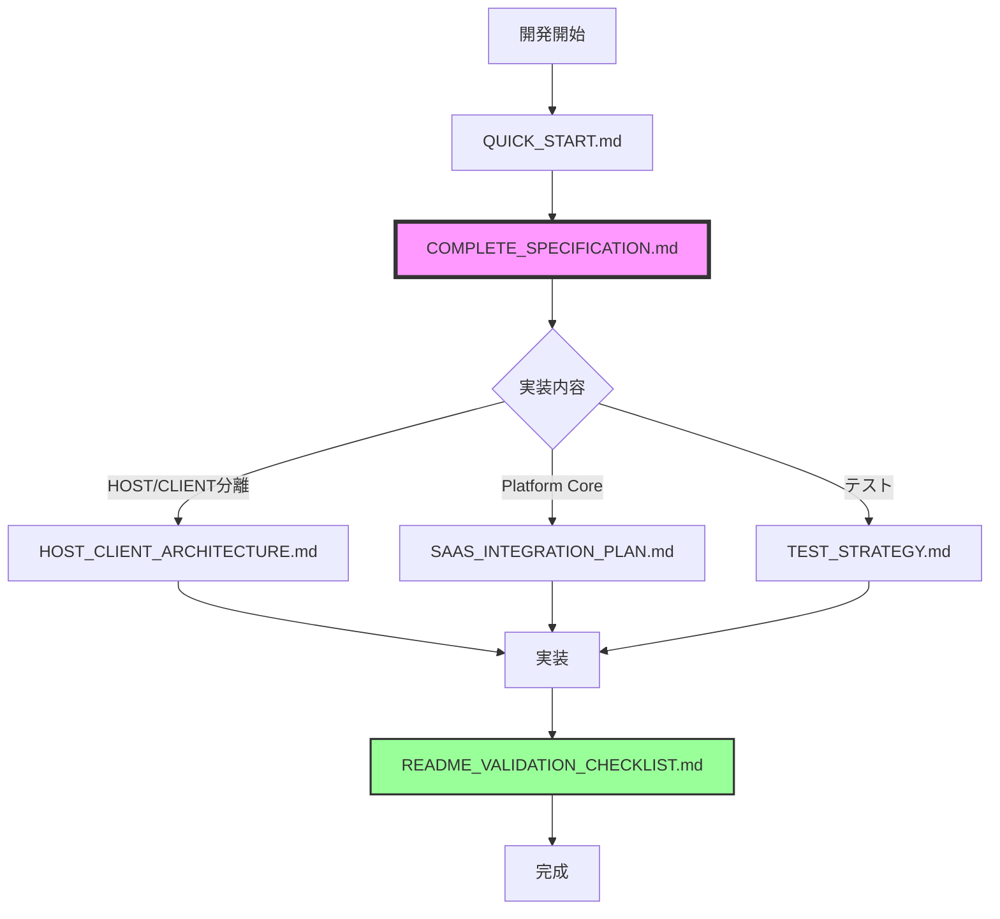

# 📚 SyncSlate AI ドキュメント構成

> **最終更新**: 2025年11月29日
> **ステータス**: 1ms精度同期アーキテクチャ実装中

## 🎯 マスター仕様書

### 1. COMPLETE_SPECIFICATION.md
**役割**: READMEに基づく正式な完全仕様書
- 製品定義
- 全機能仕様
- 技術アーキテクチャ
- Client App詳細仕様
- ロードマップ

**参照タイミング**:
- 実装前の仕様確認
- 機能の正確な理解

---

## ✅ 検証・チェックリスト

### 2. README_VALIDATION_CHECKLIST.md
**役割**: 100項目以上の実装検証リスト
- README仕様の完全準拠確認
- 実装漏れ防止
- リリース前の最終チェック

**参照タイミング**:
- 機能実装後の確認
- リリース前の品質保証

---

## 🏗️ アーキテクチャ・実装ガイド

### 3. PRECISION_SYNC_ARCHITECTURE.md ⭐ 最新
**役割**: 1ms精度同期システムの技術設計書
- NTP時刻同期サービス
- 高精度タイマー（Performance.now）
- AudioContext同期（±1ms）
- Supabase Realtime統合
- Platform Core統合
- 性能メトリクス

**参照タイミング**:
- **現在の実装フェーズで最優先**
- 高精度同期実装時
- クロスデバイス同期実装時

**実装ステータス**:
- ✅ 時刻同期サービス (services/time-sync.ts)
- ✅ 高精度タイマー (services/precision-timer.ts)
- ✅ オーディオ同期 (services/audio-sync.ts)
- 🚧 Supabaseクライアント
- 🚧 Supabase Sync Engine
- 🚧 Platform Core統合

### 4. HOST_CLIENT_ARCHITECTURE.md
**役割**: HOST/CLIENT分離の詳細設計と実装方法
- モード判定ロジック
- 認証ゲート実装
- UI分岐実装
- ビルド最適化
- **CLIENT完全無料の保証方法**

**参照タイミング**:
- HOST/CLIENT分離実装時
- 認証スキップ実装時

### 5. SAAS_INTEGRATION_PLAN.md
**役割**: Platform Core統合と全体開発計画
- Platform Core統合方法
- Clerk認証（HOSTのみ）
- 使用量管理（HOSTのみ）
- 全体の開発フェーズ
- **CLIENT無料の明記**

**参照タイミング**:
- Platform Core統合時
- 課金機能実装時

---

## 🧪 品質保証

### 6. TEST_STRATEGY.md
**役割**: テスト戦略と実装方法
- 単体テスト戦略
- 統合テスト戦略
- E2Eテストシナリオ
- パフォーマンステスト

**参照タイミング**:
- テストフレームワーク選定
- テストケース作成

---

## 🚀 実践ガイド

### 7. QUICK_START.md
**役割**: 即座に開発を始めるためのガイド
- 環境セットアップ手順
- 動作確認方法
- トラブルシューティング
- 優先タスクリスト

**参照タイミング**:
- 開発開始時
- 問題発生時

---

## 🔧 設定ファイル

### 8. .env.platform
**役割**: Platform Core統合用の環境変数テンプレート
- Clerk認証設定
- Platform Core API設定
- フィーチャーフラグ

**参照タイミング**:
- Platform Core統合準備時

### 9. .env.local
**役割**: ローカル環境変数（実際の設定）
- ✅ GEMINI_API_KEY設定済み

---

## 📊 ドキュメント参照フロー

## ⚠️ 重要な原則

### CLIENT Mode = 永久無料
すべてのドキュメントで一貫して強調されている最重要事項：
- **ログイン不要**
- **認証画面を表示しない**
- **Platform Core統合対象外**
- **超軽量実装（< 50KB）**

### 参照優先順位
1. **COMPLETE_SPECIFICATION.md** - 仕様の真実
2. **HOST_CLIENT_ARCHITECTURE.md** - 実装の真実
3. その他 - サポート資料

---

## 🗑️ 削除済みドキュメント

以下は内容を統合・更新して削除しました：
- ~~SPECIFICATION_CHECKLIST.md~~ → COMPLETE_SPECIFICATION.mdに統合
- ~~DEVELOPMENT_PLAN.md~~ → SAAS_INTEGRATION_PLAN.mdに統合
- ~~CROSS_DEVICE_SYNC_PLAN.md~~ → PRECISION_SYNC_ARCHITECTURE.mdに更新（2025-11-29）

---

**これで、READMEの仕様に完全準拠した、整理されたドキュメント構成になりました。**