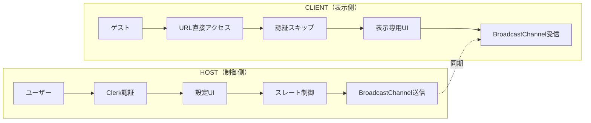

# HOST/CLIENT アーキテクチャ実装ガイド

## 🎯 重要原則

**Clientモードは永久無料・ログイン不要** - これはSyncSlate AIの核となる設計思想です。

## 📐 アーキテクチャ設計



## 🔄 モード判定ロジック

```typescript
// src/hooks/use-app-mode.ts
export type AppMode = 'HOST' | 'CLIENT';

export function useAppMode(): AppMode {
  const urlParams = new URLSearchParams(window.location.search);

  // URLパラメータで明示的に指定されている場合
  const roleParam = urlParams.get('role');
  if (roleParam === 'client') return 'CLIENT';
  if (roleParam === 'host') return 'HOST';

  // セッションIDがある場合はCLIENT
  const sessionId = urlParams.get('session');
  if (sessionId) return 'CLIENT';

  // その他の場合はHOST
  return 'HOST';
}
```

## 🚪 認証ゲート実装

```typescript
// src/components/auth-gate.tsx
import { useAppMode } from '@/hooks/use-app-mode';
import { SignedIn, SignedOut, RedirectToSignIn } from '@clerk/nextjs';

export function AuthGate({ children }: { children: React.ReactNode }) {
  const mode = useAppMode();

  // CLIENTモードは認証不要
  if (mode === 'CLIENT') {
    return <>{children}</>;
  }

  // HOSTモードは認証必須
  return (
    <>
      <SignedIn>
        {children}
      </SignedIn>
      <SignedOut>
        <RedirectToSignIn />
      </SignedOut>
    </>
  );
}
```

## 🎨 UI分岐実装

```typescript
// src/app.tsx
export function App() {
  const mode = useAppMode();

  if (mode === 'CLIENT') {
    return <ClientApp />;
  }

  return (
    <AuthGate>
      <HostApp />
    </AuthGate>
  );
}

// CLIENT専用アプリ（超軽量）
function ClientApp() {
  const [status, setStatus] = useState<'waiting' | 'armed' | 'running' | 'ended'>('waiting');
  const [displayData, setDisplayData] = useState<any>(null);

  useEffect(() => {
    const channel = new BroadcastChannel('sync-slate-v1');

    channel.addEventListener('message', (event) => {
      switch (event.data.type) {
        case 'SYNC_STATE':
          setDisplayData(event.data.payload);
          break;
        case 'CMD_START':
          setStatus('armed');
          // タイマー開始ロジック
          break;
        case 'CMD_STOP':
          setStatus('ended');
          break;
      }
    });

    return () => channel.close();
  }, []);

  return (
    <div className="client-display">
      {status === 'waiting' && (
        <div className="waiting-screen">
          <h1>WAITING FOR HOST</h1>
          <div className="pulse-animation">📡</div>
        </div>
      )}

      {status === 'running' && (
        <div className="countdown-display">
          {/* カウントダウン表示 */}
        </div>
      )}
    </div>
  );
}

// HOST専用アプリ（フル機能）
function HostApp() {
  // Platform Core統合
  const { checkQuota, recordUsage } = usePlatformCore();

  // 全ての設定UI、制御機能
  return (
    <div className="host-app">
      <PlanBadge />
      <UsageMeter />
      <SettingsPanel />
      <ControlPanel />
    </div>
  );
}
```

## 📦 ビルド最適化

```typescript
// vite.config.ts
export default defineConfig(({ mode }) => {
  const isClientBuild = process.env.BUILD_MODE === 'CLIENT';

  return {
    define: {
      // CLIENTビルド時は不要な機能を削除
      'ENABLE_SETTINGS': !isClientBuild,
      'ENABLE_AUTH': !isClientBuild,
      'ENABLE_PLATFORM_CORE': !isClientBuild,
    },
    build: {
      rollupOptions: {
        external: isClientBuild ? [
          // CLIENTビルドでは除外
          '@clerk/nextjs',
          '@google/generative-ai',
        ] : [],
      }
    }
  };
});
```

## 🔗 URL生成とシェア

```typescript
// src/utils/share.ts
export function generateClientURL(sessionId: string): string {
  const baseURL = window.location.origin;
  return `${baseURL}/?role=client&session=${sessionId}`;
}

// HOST側のシェア機能
function ShareButton() {
  const sessionId = useSessionId();

  const handleShare = () => {
    const clientURL = generateClientURL(sessionId);

    // クリップボードにコピー
    navigator.clipboard.writeText(clientURL);

    // または Web Share API
    if (navigator.share) {
      navigator.share({
        title: 'SyncSlate Session',
        text: 'Join my SyncSlate session',
        url: clientURL
      });
    }
  };

  return <button onClick={handleShare}>Share Link</button>;
}
```

## ✅ 実装チェックリスト

### 必須実装
- [ ] URLパラメータによるモード判定
- [ ] CLIENTモードでの認証スキップ
- [ ] CLIENT専用の軽量UI
- [ ] HOST/CLIENT間の同期通信
- [ ] シェアURL生成機能

### Platform Core統合時の注意
- [ ] CLIENTモードではPlatform Core APIを一切呼ばない
- [ ] HOSTモードでのみ使用量チェック
- [ ] HOSTモードでのみプラン表示

### セキュリティ考慮
- [ ] CLIENTは読み取り専用（設定変更不可）
- [ ] セッションIDの適切な生成（推測不可能）
- [ ] Request Control機能の実装（オプション）

## 🧪 テストシナリオ

### シナリオ1: CLIENT直接アクセス
```typescript
test('CLIENTモードは認証なしで即座に表示', async () => {
  // Arrange
  const url = '/?role=client&session=abc123';

  // Act
  const { container } = render(<App />, { url });

  // Assert
  expect(container).not.toContain('Sign In');
  expect(container).toContain('WAITING FOR HOST');
});
```

### シナリオ2: HOST→CLIENT共有
```typescript
test('HOSTが生成したURLでCLIENTが接続', async () => {
  // HOST側でセッション開始
  const hostApp = renderHost();
  const shareButton = hostApp.getByText('Share Link');
  fireEvent.click(shareButton);

  // 生成されたURLを取得
  const clientURL = await getClipboardText();

  // CLIENT側で接続
  const clientApp = renderClient(clientURL);

  // 同期確認
  expect(clientApp).toContain('WAITING FOR HOST');
});
```

## 📊 パフォーマンス目標

| 指標 | HOST | CLIENT |
|------|------|--------|
| 初回ロード | < 3秒 | **< 1秒** |
| バンドルサイズ | < 300KB | **< 50KB** |
| メモリ使用量 | < 100MB | **< 20MB** |
| CPU使用率 | < 30% | **< 10%** |

## 🎯 重要な設計原則

1. **CLIENTファースト**: CLIENTモードの軽量性を最優先
2. **ゼロ設定**: CLIENTはURL開くだけで動作
3. **プログレッシブ**: HOSTの機能はCLIENTに影響しない
4. **独立性**: CLIENTはPlatform Core非依存

## 🚀 段階的実装計画

### Step 1: 基本的なモード分岐（今すぐ）
```typescript
// index.tsx の最初に追加
const mode = new URLSearchParams(window.location.search).get('role');
if (mode === 'client') {
  // CLIENT専用の簡易レンダリング
  ReactDOM.render(<ClientOnlyApp />, document.getElementById('root'));
} else {
  // 既存のHOSTアプリ
  ReactDOM.render(<App />, document.getElementById('root'));
}
```

### Step 2: 認証分岐（Platform Core統合時）
- HOSTモードのみClerk認証を要求
- CLIENTモードは完全スキップ

### Step 3: ビルド最適化（本番前）
- HOST/CLIENT別々のビルド生成
- CLIENTビルドの極限的な軽量化

---

**これがSyncSlate AIの本質です**: 誰でも、どこでも、ログインなしで即座に同期表示を共有できる。