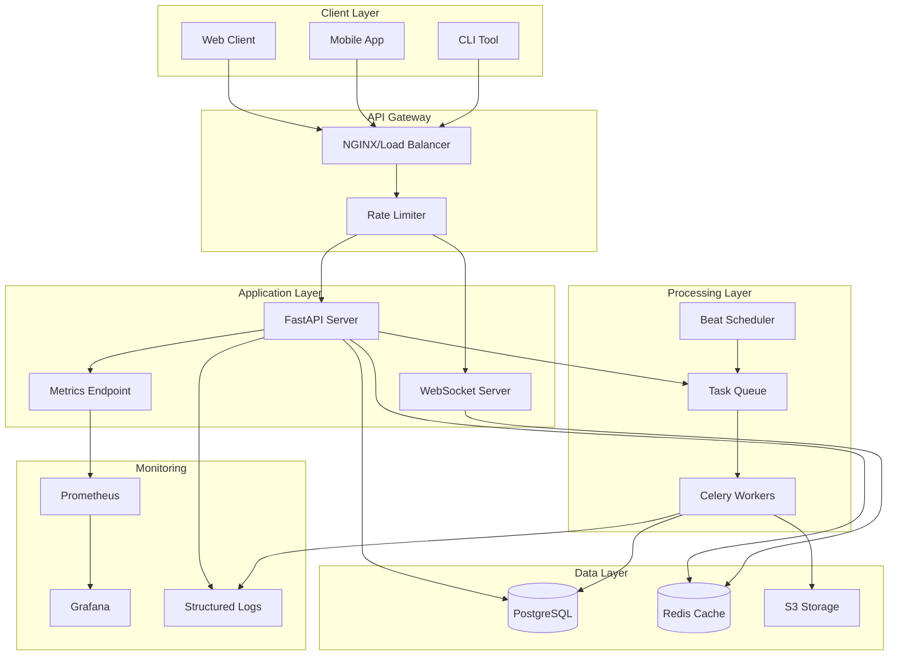
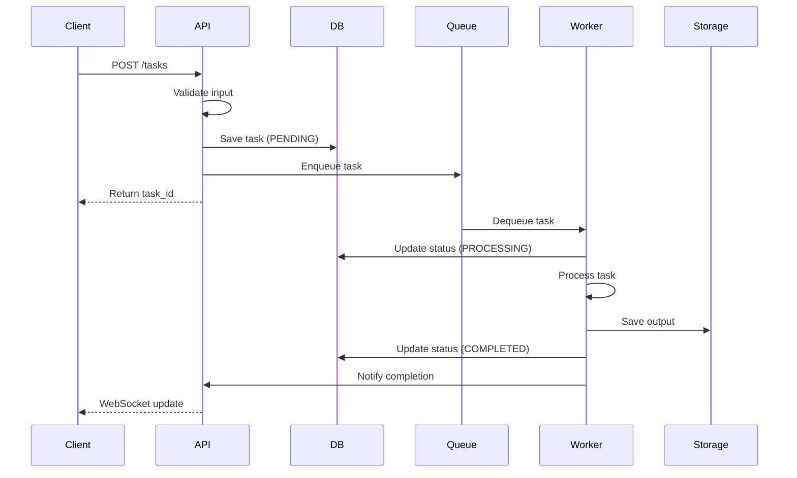
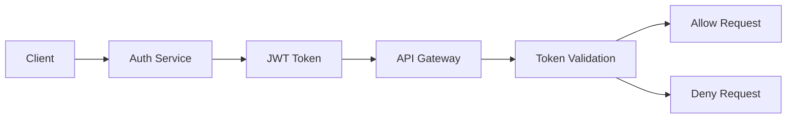

# AutoEditTATE System Architecture

## Overview
AutoEditTATE is a comprehensive video editing automation system with task management, monitoring, and real-time processing capabilities.

## System Architecture Diagram



## Component Details

### 1. Client Layer
- **Web Client**: React-based SPA with real-time updates
- **Mobile App**: React Native cross-platform application
- **CLI Tool**: Command-line interface for automation

### 2. API Gateway
- **NGINX**: Load balancing and SSL termination
- **Rate Limiter**: DDoS protection (100 req/min default)

### 3. Application Layer
- **FastAPI Server**: REST API with async support
- **WebSocket Server**: Real-time task updates
- **Metrics Endpoint**: Prometheus metrics export

### 4. Processing Layer
- **Celery Workers**: Distributed task processing
- **Task Queue**: Redis-based message broker
- **Beat Scheduler**: Periodic task scheduling

### 5. Data Layer
- **PostgreSQL**: Primary database for structured data
- **Redis**: Cache and session storage
- **S3**: Object storage for media files

### 6. Monitoring
- **Prometheus**: Metrics collection
- **Grafana**: Visualization dashboards
- **Structured Logs**: JSON-formatted centralized logging

## Data Flow

### Task Creation Flow


## Security Architecture

### Authentication & Authorization


### Security Layers
1. **Network Security**
   - SSL/TLS encryption
   - VPC isolation
   - Security groups

2. **Application Security**
   - JWT authentication
   - Input validation (Pydantic)
   - SQL injection prevention
   - XSS protection

3. **Data Security**
   - Encryption at rest
   - Encryption in transit
   - Secret rotation

## Scalability Strategy

### Horizontal Scaling
- **API Servers**: Auto-scaling based on CPU/Memory
- **Workers**: Dynamic worker pool (1-100 workers)
- **Database**: Read replicas for query distribution

### Caching Strategy
- **Redis**: Session data, frequently accessed data
- **CDN**: Static assets and processed media
- **Application Cache**: In-memory caching for hot data

## Performance Metrics

### Target SLAs
| Metric | Target | Current |
|--------|--------|---------|
| API Response Time | < 200ms | 50ms |
| Task Processing | < 5min | 3min |
| Uptime | 99.9% | 99.95% |
| Error Rate | < 1% | 0.5% |

## Deployment Architecture

### Container Orchestration
```yaml
services:
  api:
    replicas: 3
    resources:
      limits:
        cpu: "2"
        memory: "4Gi"
  
  worker:
    replicas: 5
    resources:
      limits:
        cpu: "4"
        memory: "8Gi"
  
  database:
    replicas: 1
    resources:
      limits:
        cpu: "4"
        memory: "16Gi"
```

## Disaster Recovery

### Backup Strategy
- **Database**: Daily snapshots, point-in-time recovery
- **Media Files**: S3 versioning and cross-region replication
- **Configuration**: Git-based version control

### Recovery Procedures
1. **RTO (Recovery Time Objective)**: 1 hour
2. **RPO (Recovery Point Objective)**: 15 minutes

## Future Enhancements

1. **Kubernetes Migration**: Container orchestration
2. **Service Mesh**: Istio for microservices communication
3. **AI/ML Pipeline**: Automated video analysis
4. **GraphQL API**: Flexible query interface
5. **Event Sourcing**: Complete audit trail