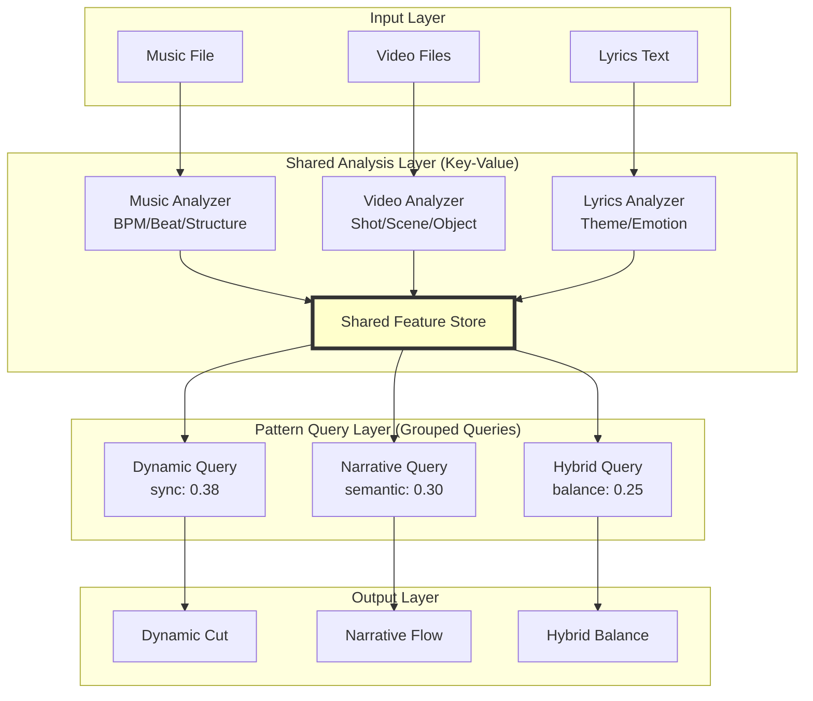

# GQAアーキテクチャ導入計画書
Version: 1.0
Date: 2025-08-08
Status: Draft
Author: Development Team

## 概要
Grouped Query Attention (GQA) の考え方をAutoEditTATEの自動編集システムに適用し、処理効率とメモリ使用量を大幅に改善する実装計画。

---

## 1. GQAアーキテクチャの基本概念

### 1.1 GQAとは
```yaml
定義:
  - LLMで使用される効率化手法
  - Query headsを複数グループに分割
  - 各グループがKey-Valueペアを共有
  
メリット:
  - メモリ使用量: 40-60%削減
  - 処理速度: 並列化により高速化
  - 品質: ほぼ同等の出力品質を維持
```

### 1.2 AutoEditTATEへの適用理由
```yaml
現状の課題:
  - 3パターン生成で同じ処理を3回実行
  - メモリ使用量が3倍
  - 処理時間がリニアに増加

GQA適用の利点:
  - 共通処理を1回に削減
  - メモリ効率の大幅改善
  - 並列処理による高速化
```

---

## 2. 実装アーキテクチャ

### 2.1 システム構成図


### 2.2 コアコンポーネント

#### SharedFeatureExtractor
```typescript
interface SharedFeatureExtractor {
  // 一度だけ実行される解析
  analyzeMusic(audio: AudioBuffer): MusicFeatures;
  analyzeVideo(frames: VideoFrames): VideoFeatures;
  analyzeLyrics(text: string): LyricsFeatures;
  
  // 結果をキャッシュ
  cacheFeatures(features: SharedFeatures): void;
}
```

#### PatternQueryEngine
```typescript
interface PatternQueryEngine {
  // 共有特徴量を使用してパターン生成
  generateDynamic(shared: SharedFeatures): EditPattern;
  generateNarrative(shared: SharedFeatures): EditPattern;
  generateHybrid(shared: SharedFeatures): EditPattern;
}
```

---

## 3. 実装フェーズ

### Phase 1: 基盤構築（2週間）

#### タスクリスト
- [ ] SharedFeatureExtractor クラスの設計
- [ ] 既存の解析処理を共有層に移行
- [ ] Feature Store の実装（メモリ管理）
- [ ] キャッシュメカニズムの実装
- [ ] 単体テストの作成

#### 成果物
- [ ] `src/core/gqa/SharedFeatureExtractor.ts`
- [ ] `src/core/gqa/FeatureStore.ts`
- [ ] `src/core/gqa/types.ts`
- [ ] テストカバレッジ 80%以上

### Phase 2: クエリエンジン実装（2週間）

#### タスクリスト
- [ ] PatternQueryEngine インターフェース定義
- [ ] DynamicQuery クラス実装
- [ ] NarrativeQuery クラス実装
- [ ] HybridQuery クラス実装
- [ ] 並列処理の最適化
- [ ] 統合テストの作成

#### 成果物
- [ ] `src/core/gqa/queries/DynamicQuery.ts`
- [ ] `src/core/gqa/queries/NarrativeQuery.ts`
- [ ] `src/core/gqa/queries/HybridQuery.ts`
- [ ] パフォーマンステスト結果

### Phase 3: 最適化と統合（1週間）

#### タスクリスト
- [ ] メモリプロファイリング
- [ ] ボトルネック分析
- [ ] Worker Threads での並列化
- [ ] 既存システムとの統合
- [ ] エラーハンドリング強化
- [ ] ドキュメント作成

#### 成果物
- [ ] パフォーマンス改善レポート
- [ ] 統合ガイドライン
- [ ] APIドキュメント

---

## 4. 技術的実装詳細

### 4.1 共有特徴量の定義
```typescript
interface SharedFeatures {
  music: {
    bpm: number;
    beats: Float32Array;
    structure: MusicStructure[];
    energy: Float32Array;
  };
  
  video: {
    shotBoundaries: number[];
    sceneChanges: SceneChange[];
    motionVectors: Float32Array[];
    colorHistograms: Histogram[];
  };
  
  lyrics: {
    phrases: LyricPhrase[];
    emotions: EmotionScore[];
    keywords: string[];
    semanticEmbeddings: Float32Array[];
  };
  
  metadata: {
    duration: number;
    fps: number;
    resolution: Resolution;
    timestamp: number;
  };
}
```

### 4.2 メモリ最適化戦略
```yaml
戦略:
  1. Typed Arrays の使用:
     - Float32Array for 数値配列
     - Uint32Array for インデックス
  
  2. Object Pooling:
     - 頻繁に生成/破棄されるオブジェクトの再利用
  
  3. Incremental Processing:
     - 大きなファイルをチャンク処理
  
  4. WeakMap によるキャッシュ:
     - 自動的なメモリ解放
```

---

## 5. パフォーマンス目標

### 5.1 定量的目標
| メトリクス | 現状 | 目標 | 改善率 |
|-----------|------|------|--------|
| 処理時間（60秒） | 8分 | 5分 | 37.5% |
| 処理時間（90秒） | 12分 | 7分 | 41.7% |
| メモリ使用量 | 4GB | 2.5GB | 37.5% |
| CPU使用率 | 300% | 180% | 40% |

### 5.2 品質保証
- [ ] 既存の3パターンと同等の品質維持
- [ ] QAスイート全項目合格
- [ ] aggregateConfidence ≥ 0.88

---

## 6. リスクと対策

### 6.1 技術的リスク
| リスク | 影響度 | 対策 |
|--------|--------|------|
| 共有特徴量の不整合 | 高 | 厳密な型定義とバリデーション |
| メモリリーク | 中 | プロファイリングツール導入 |
| 並列処理の競合 | 中 | イミュータブルデータ構造 |

### 6.2 スケジュールリスク
- [ ] バッファ期間を各フェーズに1週間追加
- [ ] 段階的なロールアウト計画
- [ ] フォールバック機能の実装

---

## 7. テスト計画

### 7.1 単体テスト
- [ ] SharedFeatureExtractor のテスト
- [ ] 各Query クラスのテスト
- [ ] FeatureStore のテスト
- [ ] ユーティリティ関数のテスト

### 7.2 統合テスト
- [ ] End-to-End フローテスト
- [ ] 3パターン生成の整合性テスト
- [ ] メモリ使用量の監視テスト
- [ ] 処理時間のベンチマーク

### 7.3 パフォーマンステスト
- [ ] 負荷テスト（大量素材）
- [ ] ストレステスト（長時間実行）
- [ ] メモリリークテスト
- [ ] 並列処理の効率測定

---

## 8. 実装チェックリスト

### 準備フェーズ
- [ ] 既存コードのリファクタリング範囲特定
- [ ] 依存関係の整理
- [ ] 開発環境のセットアップ
- [ ] ベンチマーク環境の構築

### 開発フェーズ
- [ ] Phase 1 完了（基盤構築）
- [ ] Phase 2 完了（クエリエンジン）
- [ ] Phase 3 完了（最適化と統合）

### 検証フェーズ
- [ ] パフォーマンステスト合格
- [ ] QAスイート全項目合格
- [ ] ユーザー受け入れテスト
- [ ] ドキュメント完成

### デプロイフェーズ
- [ ] 本番環境への段階的ロールアウト
- [ ] モニタリング設定
- [ ] ロールバック計画の準備
- [ ] 運用ドキュメントの更新

---

## 9. 成功基準

### 必須要件
- [ ] 処理時間が目標値以下
- [ ] メモリ使用量が目標値以下
- [ ] 既存品質の維持（QAスイート合格）
- [ ] 後方互換性の維持

### 追加目標
- [ ] リアルタイムプレビュー対応の基盤
- [ ] 4パターン以上への拡張性
- [ ] プラグインアーキテクチャ対応

---

## 10. 今後の拡張可能性

### 10.1 短期的拡張
```yaml
3ヶ月以内:
  - パターン数の動的変更
  - カスタムクエリの追加
  - 部分的な再計算機能
```

### 10.2 長期的ビジョン
```yaml
6ヶ月〜1年:
  - リアルタイム編集対応
  - クラウド処理との統合
  - 機械学習モデルの組み込み
  - ユーザー好みの学習機能
```

---

## 11. 参考資料

### 技術文献
- [Grouped Query Attention Paper](https://arxiv.org/abs/2305.13245)
- [Efficient Transformers Survey](https://arxiv.org/abs/2009.06732)

### 内部ドキュメント
- [REQUIREMENTS-SPEC-2025-08-08.md](./REQUIREMENTS-SPEC-2025-08-08.md)
- [QA-SUITE-SPECIFICATION-2025-08-08.md](./QA-SUITE-SPECIFICATION-2025-08-08.md)

---

## 更新履歴

| 日付 | バージョン | 変更内容 | 担当者 |
|------|-----------|----------|--------|
| 2025-08-08 | 1.0 | 初版作成 | Development Team |

---

## 承認

### レビュー承認
- [ ] テクニカルリード承認
- [ ] プロダクトマネージャー承認
- [ ] QAチーム承認

### 実装開始承認
- [ ] 最終承認
- [ ] キックオフミーティング完了
- [ ] リソース割り当て完了