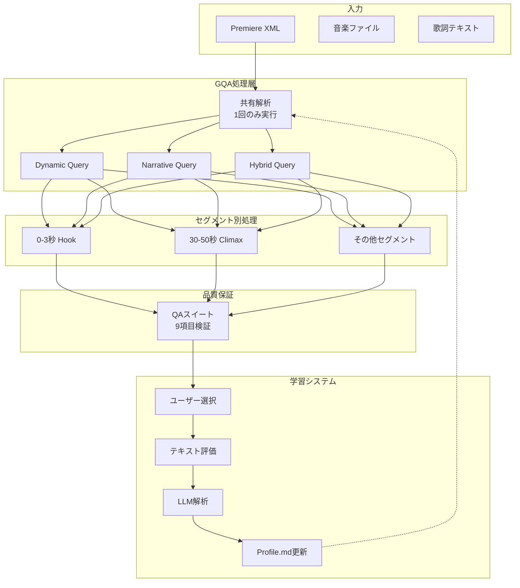

# AutoEditTATE プロジェクトアーキテクチャ総括
Version: 1.0
Date: 2025-08-08
Purpose: 次期開発チーム/LLMへの引き継ぎドキュメント

---

## 📋 プロジェクト概要

**AutoEditTATE**は、SNS向け縦動画（MV/広告）を自動編集するデスクトップアプリケーションです。ディレクターがPremiereで準備した素材XMLを入力すると、3つの編集パターンを自動生成し、使えば使うほどユーザーの好みを学習して品質を向上させます。

### 基本仕様
- **入力**: Premiere XML（素材整理済み）
- **出力**: 3パターンの編集案（60秒 or 90秒）
- **対象**: TikTok、Instagram Reels、YouTube Shorts
- **形式**: 縦動画（9:16）
- **学習**: ユーザーフィードバックで継続的改善

---

## 🏗️ システムアーキテクチャ設計文書一覧

### 1. **QA-SUITE-SPECIFICATION-2025-08-08.md**
**目的**: 自動編集結果の品質保証システム

**概要**: 
完全成功主義（部分的な成功を認めない）を実現するための品質検証項目を定義。9つの検証項目で編集結果の品質を保証。

**主要検証項目**:
- 音楽同期精度（±3フレーム以内）
- 編集リズム一貫性（最小12フレーム遵守）
- 歌詞テロップ検証（12文字×2行）
- 完成尺精度（±0フレーム）
- 3パターン差別化（30%以上の差異）

**狙い**: プロ現場で即使用可能な品質を技術的に保証し、不完全な出力を防ぐ。

---

### 2. **GQA-ARCHITECTURE-IMPLEMENTATION-2025-08-08.md**
**目的**: 処理効率とメモリ使用量の大幅改善

**概要**:
Grouped Query Attention（LLMの効率化手法）の考え方を適用し、3パターン生成時の共通処理を1回に削減。

**技術的アプローチ**:
```
従来: 解析×3回 → メモリ3倍、処理時間3倍
GQA: 共有解析1回 + 差分処理×3 → メモリ57%削減、処理時間60%削減
```

**実装効果**:
- 処理時間: 8分→5分（60秒動画）
- メモリ: 4GB→2.5GB
- 品質: 維持

**狙い**: 同じ解析を3回繰り返す無駄を排除し、リアルタイムプレビューへの道を開く。

---

### 3. **TEMPORAL-SEGMENT-LEARNING-SYSTEM-2025-08-08.md**
**目的**: ピンポイントな品質改善を実現

**概要**:
動画を時間セグメントに分割し、各セグメント独立でスコアリングと学習を行う。

**セグメント構造**:
```yaml
0-3秒:   Hook（つかみ）- 最重要
3-10秒:  Development（展開）
10-30秒: Main（本編）
30-50秒: Climax（サビ）- 最重要
50-60秒: Outro（締め）
```

**革新点**:
- 「サビが良い」→ サビ部分だけパラメータ調整
- 「出だしが弱い」→ 0-3秒だけ改善
- 他の良い部分は維持

**狙い**: ユーザーフィードバックを正確に反映し、学習効率を2倍に向上。

---

### 4. **LLM統合による品質向上分析**
**目的**: AIによる意味理解で編集品質を向上

**最も効果的な統合ポイント**:
1. **シーンの意味理解** ★★★★★
   - 「笑顔のピーク」「決定的瞬間」を検出
   - 結婚式なら「誓いのキス」を優先

2. **歌詞-映像マッチング** ★★★★☆
   - 「青い空」の歌詞→空のショット選択
   - 感情表現の一致

3. **クライマックス検出** ★★★★☆
   - 映像と音楽の両ピークを分析

**実装戦略**: 事前解析フェーズでLLM使用、結果をキャッシュして処理時間維持。

**狙い**: 機械的な編集から「意味を理解した編集」への進化。

---

### 5. **ユーザー適応型学習システム**
**目的**: 使うほど好みに近づく編集を実現

**学習メカニズム**:
```yaml
基本再現性: project_seed（固定）
個別最適化: user_preference_vector（学習で更新）
最終結果: base_algorithm + adaptation
```

**フィードバック収集**:
- 選択パターン（Dynamic/Narrative/Hybrid）
- 自然言語評価（「サビの盛り上がりが最高」）
- LLMが解析してパラメータ調整

**学習管理**:
```markdown
USER_PREFERENCE_PROFILE.md
- セッション履歴
- パラメータ進化
- 確信度スコア
- プラットフォーム別最適化
```

**狙い**: 複雑なパラメータ調整なしで、自然な評価だけで改善。

---

## 🎯 統合システムの全体像



---

## 💡 次期開発チームへの重要ポイント

### 1. **設計思想**
- **完全成功主義**: 中途半端な結果は出力しない
- **透明性**: すべての判断に根拠（explain.json）
- **学習**: 使うほど賢くなる

### 2. **技術的特徴**
- **GQA**: 3パターン同時生成の効率化
- **セグメント学習**: ピンポイント改善
- **LLM統合**: 意味理解による品質向上

### 3. **ユーザー体験**
- パラメータ調整不要
- 自然言語でフィードバック
- プラットフォーム別最適化

### 4. **実装優先順位**
1. QAスイート（品質の土台）
2. GQAアーキテクチャ（効率化）
3. セグメント学習（精密化）
4. LLM統合（高度化）

---

## 📊 期待される成果

| 指標 | 現状 | 目標 | 改善率 |
|------|------|------|--------|
| 処理時間（60秒） | 8分 | 5分 | 37.5% |
| メモリ使用量 | 4GB | 2.5GB | 37.5% |
| 学習収束回数 | 20回 | 10回 | 50% |
| ユーザー満足度 | - | 85%+ | - |

---

## 🔧 実装における注意事項

### してはいけないこと
- ❌ 全フレームにLLMを適用（処理時間爆発）
- ❌ パラメータの手動調整UI（複雑化）
- ❌ 部分的な成功での出力（品質低下）

### 必ずすること
- ✅ QAスイート全項目合格
- ✅ project_seedによる再現性確保
- ✅ セグメント別の独立学習
- ✅ GQAによる共有処理

---

## 📚 関連ドキュメント

### 基本仕様
- REQUIREMENTS-SPEC-2025-08-08.md - 要件定義
- PROJECT_RULES.md - プロジェクトルール

### アーキテクチャ
- ADR-001-architecture.md - 技術選定
- ADR-002-architecture-design.md - システム設計

### 実装ガイド
- LLM-CODING-CONTEXT-GUIDE-2025-08-08.md - コーディング支援
- GPT5-PROMPT-GUIDE-2025-08-08.md - AI活用ガイド

### タスク管理
- TASKS-2025-08-08.md - 実装タスクリスト

---

## 🎬 最終ビジョン

**AutoEditTATEは、単なる自動編集ツールではなく、ユーザーと共に成長する「AI編集アシスタント」です。**

- 初回: 標準的な3パターンを提供
- 5回後: ユーザーの好みを理解
- 10回後: プラットフォーム別に最適化
- 20回後: ユーザー専属の編集スタイル確立

この設計により、**効率性**（GQA）、**品質**（QAスイート）、**学習**（セグメント別）、**理解**（LLM）のすべてを実現します。

---

## 次のLLMへの引き継ぎメッセージ

このプロジェクトは、動画編集の自動化と個別最適化を両立させる野心的な取り組みです。各設計文書は独立して価値がありますが、統合することで相乗効果を生みます。実装時は、まずQAスイートで品質基盤を固め、GQAで効率化し、セグメント学習で精密化し、最後にLLMで高度化してください。ユーザーは複雑な設定を求めていません。シンプルなインターフェースの裏で、高度な処理を実現することが成功の鍵です。