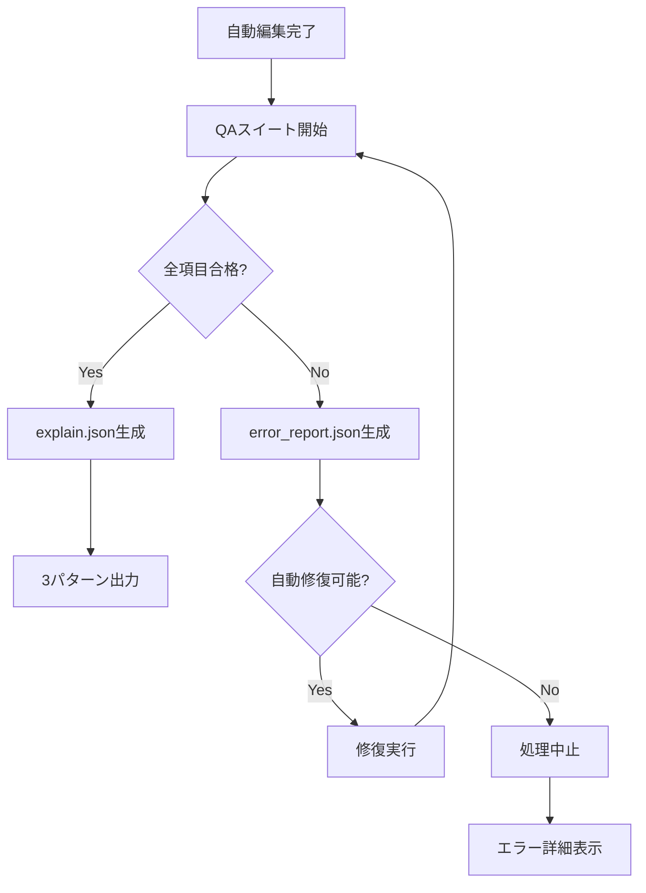

# QAスイート仕様書
Version: 1.0
Date: 2025-08-08
Status: Active

## 概要
AutoEditTATEの自動編集結果の品質を保証するための検証項目を定義する。
ディレクターがPremiereで事前に素材を整理済みという前提で、自動編集の品質に特化した検証を行う。

## 出力仕様
- **完成尺**: 60秒 または 90秒（固定）
- **入力**: Premiere XMLで整理済みの素材群
- **出力**: 3パターンの編集案（dynamic_cut / narrative_flow / hybrid_balance）

---

## 📋 QAスイート検証項目

### 1. 音楽同期精度検証
```yaml
validateMusicSync:
  目的: "カットと音楽の同期精度を保証"
  
  検証項目:
    - カット点が音楽の拍/小節に合っているか
    - ビート検出精度（±3フレーム以内）
    - 構造マーカー（サビ、Aメロ、ブリッジ）との整合性
    - フェードイン/アウトのタイミング適正性
    
  合格基準:
    - 同期ずれ中央値: 0フレーム
    - 同期ずれP95: ≤ 3フレーム
    - 構造マーカー合致率: ≥ 85%
```

### 2. 編集リズム一貫性検証
```yaml
validateEditingRhythm:
  目的: "編集のリズムとテンポの適正性を保証"
  
  検証項目:
    - カット間隔の規則性（意図的な変化 vs エラー）
    - 最小ショット長（12フレーム）の遵守
    - ジャンプカット回避（類似構図の連続防止）
    - カット密度の適正性
    
  合格基準:
    - 最小ショット長違反: 0件
    - ジャンプカット検出: ≤ 2箇所
    - リズム一貫性スコア: ≥ 0.8
```

### 3. 歌詞テロップ検証
```yaml
validateLyricsCues:
  目的: "歌詞表示の可読性と同期を保証"
  
  検証項目:
    - 表示タイミングと音楽の同期
    - 表示時間の適正性（最小0.8秒、最大3秒）
    - 重なり防止（前後のテロップと被らない）
    - 禁則処理（句読点の行頭回避）
    - 文字数制限（横12文字、最大2行）の遵守
    
  合格基準:
    - タイミングずれ: ≤ 2フレーム
    - 文字数制限違反: 0件
    - 重なり検出: 0件
    - 最小表示時間違反: 0件
```

### 4. シーン連続性検証
```yaml
validateSceneContinuity:
  目的: "視覚的な流れの自然さを保証"
  
  検証項目:
    - 被写体の動きベクトル連続性
    - 視線誘導の流れ（画面の注視点遷移）
    - 極端なサイズ変化の回避（ロング→アップの急変）
    
  合格基準:
    - 動きベクトル逆転: ≤ 3箇所
    - サイズジャンプ: ≤ 2箇所
    - 連続性スコア: ≥ 0.75
```

### 5. 3パターン差別化検証
```yaml
validatePatternDifference:
  目的: "各編集パターンの明確な差異を保証"
  
  検証項目:
    dynamic_cut:
      - 平均ショット長: 0.8〜1.5秒
      - カット数: 60秒で40〜75カット
      - 音楽同期率: ≥ 90%
      
    narrative_flow:
      - 平均ショット長: 2〜4秒
      - カット数: 60秒で15〜30カット
      - ストーリー連続性: ≥ 85%
      
    hybrid_balance:
      - 平均ショット長: 1.5〜2.5秒
      - カット数: 60秒で24〜40カット
      - バランススコア: 各指標の中間値
      
  合格基準:
    - パターン間の差異: ≥ 30%
    - 各パターンの特徴充足率: ≥ 80%
```

### 6. 完成尺精度検証
```yaml
validateDuration:
  目的: "指定された完成尺の厳密な遵守"
  
  検証項目:
    - 総尺: 60秒 or 90秒（±0フレーム）
    - 最初のカット開始: 0フレーム
    - 最後のカット終了: 指定尺ちょうど
    - ブラックフレーム: 先頭/末尾0フレーム
    
  合格基準:
    - 尺の誤差: 0フレーム（完全一致）
    - 不要な余白: 0フレーム
```

### 7. 出力XML整合性検証
```yaml
validateOutputXML:
  目的: "NLEでの読み込み成功を保証"
  
  検証項目:
    - 元のNLE形式維持（Premiere→Premiere）
    - エフェクト記述の妥当性
    - オーディオレベル設定の保持
    - クリップ参照パスの完全性
    - XMLスキーマ準拠
    
  合格基準:
    - スキーマ検証: エラー0件
    - 参照エラー: 0件
    - 形式一致: 100%
```

### 8. メタデータ完全性検証
```yaml
validateMetadata:
  目的: "判断根拠の透明性を保証"
  
  必須項目:
    explain.json:
      - pattern: "dynamic_cut | narrative_flow | hybrid_balance"
      - subscores: {sync, semantic, visual, stability}
      - aggregateConfidence: [0.0-1.0]
      - reasons: ["判断根拠の配列"]
      - warnings: ["注意事項の配列"]
      - project_seed: "再現性のためのシード値"
      
  合格基準:
    - 必須フィールド欠損: 0件
    - aggregateConfidence: ≥ 0.88
    - reasons配列: 5項目以上
```

### 9. パフォーマンス基準検証
```yaml
validatePerformance:
  目的: "実用的な処理時間を保証"
  
  検証項目:
    処理時間:
      - 60秒尺: ≤ 8分
      - 90秒尺: ≤ 12分
      
    リソース使用:
      - メモリ使用量: ≤ 4GB
      - 一時ファイル: 処理後に0KB
      
  合格基準:
    - 処理時間超過: 0件
    - メモリリーク: 0件
    - 一時ファイル残留: 0件
```

---

## 🚫 削除された検証項目

以下の項目はPremiereで事前解決済み、または不要と判断：

```yaml
削除項目:
  - フレームレート整合性
  - コーデック互換性
  - 解像度統一
  - サンプルレート統一
  - カラーマッチング
  - アクションつなぎ
```

---

## 📊 QAスイート実行フロー



---

## 🎯 成功基準サマリー

| カテゴリ | 目標値 |
|---------|--------|
| 全体成功率 | ≥ 97% |
| 音楽同期精度 | P95 ≤ 3フレーム |
| 完成尺精度 | ±0フレーム |
| 処理時間（60秒） | ≤ 8分 |
| 処理時間（90秒） | ≤ 12分 |
| 確信度 | ≥ 0.88 |

---

## 更新履歴

| 日付 | バージョン | 変更内容 |
|------|-----------|----------|
| 2025-08-08 | 1.0 | 初版作成、完成尺を60/90秒に固定 |