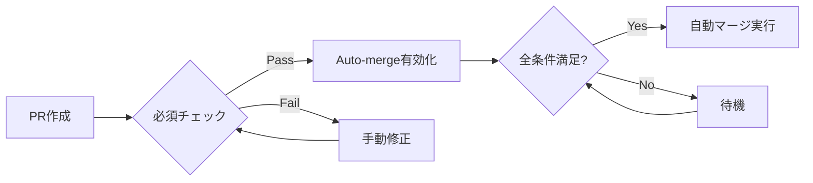

# 自動マージ運用ガイド

## 概要

本ドキュメントは、AutoEditTATEプロジェクトにおけるPull Requestの自動マージ機能の運用方法と、安全な自動化のためのガイドラインを定めたものです。

## 自動マージの仕組み

### GitHub Auto-merge 機能

GitHub の Auto-merge 機能を使用することで、すべての必要な条件が満たされた時点で自動的にPRがマージされます。



## 自動マージ有効化の条件

### 必須条件（Required）

以下のすべての条件を満たす必要があります：

1. **ステータスチェック**
   - CI/CDパイプラインの成功
   - テストの全件パス
   - Lintチェックのパス
   - タイプチェックのパス

2. **レビュー承認**
   - 最低1名のレビュアーからの承認
   - 未解決のレビューコメントがない

3. **ブランチ保護ルール**
   - mainブランチへの直接プッシュ禁止
   - force pushの禁止
   - 削除保護の有効化

### 推奨条件（Recommended）

品質維持のため、以下の条件も考慮してください：

- コードカバレッジ80%以上
- セキュリティスキャンのパス
- パフォーマンステストの基準クリア

## 自動マージの設定方法

### 1. リポジトリレベルの設定

```bash
# GitHub CLIを使用した設定
gh repo edit ShoheiFukushima/AutoEditTATE \
  --enable-auto-merge \
  --delete-branch-on-merge
```

### 2. ブランチ保護ルールの設定

```bash
# mainブランチの保護設定
gh api repos/ShoheiFukushima/AutoEditTATE/branches/main/protection \
  --method PUT \
  --field required_status_checks='{"strict":true,"contexts":["test","lint","typecheck"]}' \
  --field enforce_admins=false \
  --field required_pull_request_reviews='{"required_approving_review_count":1,"dismiss_stale_reviews":true}' \
  --field restrictions=null \
  --field allow_force_pushes=false \
  --field allow_deletions=false
```

### 3. PRごとの自動マージ有効化

```bash
# CLIでの有効化
gh pr merge <PR_NUMBER> \
  --auto \
  --merge \
  --repo ShoheiFukushima/AutoEditTATE

# または、PRコメントで有効化
gh pr comment <PR_NUMBER> \
  --body "@dependabot merge" \
  --repo ShoheiFukushima/AutoEditTATE
```

## ラベルベースの自動マージ

### 自動マージ対象ラベル

| ラベル | 説明 | 自動マージ条件 |
|-------|------|--------------|
| `auto-merge` | 自動マージ対象 | 全チェックパス + 承認1名 |
| `dependencies` | 依存関係更新 | セキュリティチェックパス |
| `documentation` | ドキュメント更新 | Lintチェックパス |
| `hotfix` | 緊急修正 | テストパス + 承認2名 |
| `chore` | 雑務 | 基本チェックパス |

### GitHub Actions による自動化

```yaml
# .github/workflows/auto-merge.yml
name: Auto Merge

on:
  pull_request_review:
    types: [submitted]
  check_suite:
    types: [completed]

jobs:
  auto-merge:
    runs-on: ubuntu-latest
    if: |
      github.event.review.state == 'approved' ||
      github.event.check_suite.conclusion == 'success'
    
    steps:
      - name: Check labels
        uses: actions/github-script@v7
        with:
          script: |
            const labels = context.payload.pull_request?.labels || [];
            const hasAutoMerge = labels.some(l => l.name === 'auto-merge');
            
            if (!hasAutoMerge) {
              console.log('No auto-merge label found');
              return;
            }
            
      - name: Enable auto-merge
        if: contains(github.event.pull_request.labels.*.name, 'auto-merge')
        run: |
          gh pr merge "${{ github.event.pull_request.number }}" \
            --auto \
            --merge \
            --repo "${{ github.repository }}"
        env:
          GH_TOKEN: ${{ secrets.GITHUB_TOKEN }}
```

## Dependabot との統合

### Dependabot 設定

```yaml
# .github/dependabot.yml
version: 2
updates:
  - package-ecosystem: "npm"
    directory: "/"
    schedule:
      interval: "weekly"
      day: "monday"
      time: "09:00"
      timezone: "Asia/Tokyo"
    open-pull-requests-limit: 10
    labels:
      - "dependencies"
      - "auto-merge"
    reviewers:
      - "ShoheiFukushima"
    commit-message:
      prefix: "chore"
      include: "scope"
```

### Dependabot 自動マージワークフロー

```yaml
# .github/workflows/dependabot-auto-merge.yml
name: Dependabot Auto Merge

on:
  pull_request:
    types: [opened, synchronize]

permissions:
  contents: write
  pull-requests: write

jobs:
  dependabot:
    runs-on: ubuntu-latest
    if: github.actor == 'dependabot[bot]'
    
    steps:
      - name: Dependabot metadata
        id: metadata
        uses: dependabot/fetch-metadata@v1
        with:
          github-token: "${{ secrets.GITHUB_TOKEN }}"
      
      - name: Auto-merge minor updates
        if: steps.metadata.outputs.update-type == 'version-update:semver-minor'
        run: |
          gh pr review --approve "$PR_URL"
          gh pr merge --auto --merge "$PR_URL"
        env:
          PR_URL: ${{ github.event.pull_request.html_url }}
          GH_TOKEN: ${{ secrets.GITHUB_TOKEN }}
```

## マージ戦略

### マージ方法の選択基準

| マージ方法 | 使用場面 | コマンド |
|-----------|---------|----------|
| **Merge Commit** | 機能ブランチ、大規模変更 | `--merge` |
| **Squash** | 小規模修正、コミット整理が必要 | `--squash` |
| **Rebase** | 単純な変更、履歴をクリーンに保つ | `--rebase` |

### 設定例

```bash
# Squash マージを強制
gh pr merge <PR_NUMBER> \
  --auto \
  --squash \
  --delete-branch \
  --repo ShoheiFukushima/AutoEditTATE
```

## 安全対策とロールバック

### 自動マージの一時停止

緊急時には以下の方法で自動マージを停止できます：

```bash
# 特定のPRの自動マージを無効化
gh pr merge <PR_NUMBER> \
  --disable-auto \
  --repo ShoheiFukushima/AutoEditTATE

# ブランチ保護の一時的な強化
gh api repos/ShoheiFukushima/AutoEditTATE/branches/main/protection \
  --method PATCH \
  --field required_approving_review_count=2
```

### ロールバック手順

誤ったマージが発生した場合：

```bash
# 1. マージコミットの特定
git log --oneline --graph -10

# 2. リバートPRの作成
gh pr create \
  --title "Revert: <original PR title>" \
  --body "Reverting PR #<number> due to <reason>" \
  --label "hotfix" \
  --repo ShoheiFukushima/AutoEditTATE

# 3. 緊急リバート（管理者権限が必要）
git revert -m 1 <merge-commit-hash>
git push origin main --force-with-lease
```

## モニタリングとアラート

### Slack通知の設定

```yaml
# .github/workflows/merge-notification.yml
name: Merge Notification

on:
  pull_request:
    types: [closed]

jobs:
  notify:
    if: github.event.pull_request.merged == true
    runs-on: ubuntu-latest
    
    steps:
      - name: Send Slack notification
        uses: slackapi/slack-github-action@v1
        with:
          payload: |
            {
              "text": "PR Merged",
              "blocks": [{
                "type": "section",
                "text": {
                  "type": "mrkdwn",
                  "text": "*PR #${{ github.event.pull_request.number }}* has been merged\n${{ github.event.pull_request.title }}"
                }
              }]
            }
        env:
          SLACK_WEBHOOK_URL: ${{ secrets.SLACK_WEBHOOK_URL }}
```

### メトリクス収集

追跡すべき指標：

- 自動マージ成功率
- マージまでの平均時間
- ロールバック頻度
- ブロックされたマージの理由

## トラブルシューティング

### 問題: 自動マージが実行されない

**確認事項**:
```bash
# PRの状態確認
gh pr view <PR_NUMBER> --json mergeable,mergeStateStatus

# 必須チェックの状態
gh pr checks <PR_NUMBER>

# ブランチ保護ルールの確認
gh api repos/ShoheiFukushima/AutoEditTATE/branches/main/protection
```

### 問題: 無限ループの発生

**原因**: CI/CDが新しいコミットをプッシュし続ける

**解決策**:
```yaml
# ワークフローでスキップ条件を追加
if: |
  !contains(github.event.head_commit.message, '[skip ci]') &&
  !contains(github.event.head_commit.message, '[ci skip]')
```

## ベストプラクティス

### DO ✅

1. **段階的な導入**
   - まず特定のラベルでテスト
   - 徐々に対象を拡大

2. **明確な基準設定**
   - 自動マージ対象の明確化
   - チーム全体での合意形成

3. **監査ログの保持**
   - すべての自動マージを記録
   - 定期的なレビュー実施

### DON'T ❌

1. **過度な自動化**
   - セキュリティ関連は手動レビュー必須
   - 大規模変更は慎重に

2. **チェックの省略**
   - テストなしでの自動マージ
   - レビューなしでの本番デプロイ

## 関連ドキュメント

- [GitHub Branch Protection](https://docs.github.com/en/repositories/configuring-branches-and-merges-in-your-repository/defining-the-mergeability-of-pull-requests/about-protected-branches)
- [GitHub Auto-merge](https://docs.github.com/en/pull-requests/collaborating-with-pull-requests/incorporating-changes-from-a-pull-request/automatically-merging-a-pull-request)
- [CI/CD運用ガイド](./CI-CD-OPERATIONS.md)

---

最終更新: 2025-08-22
バージョン: 1.0.0