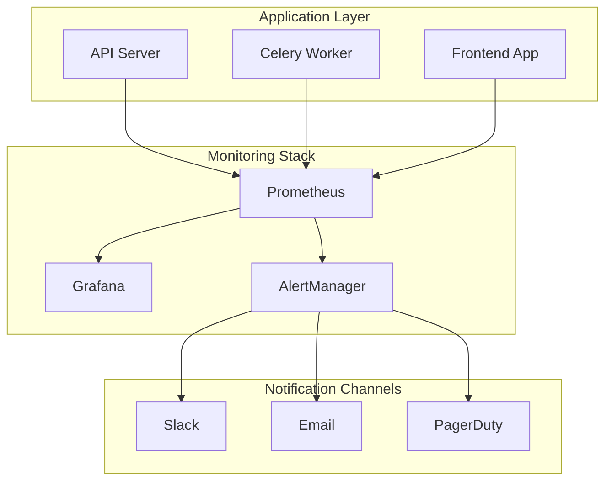

# 監視・アラート設定ガイド

## 概要

本ドキュメントは、AutoEditTATEプロジェクトの監視体制とアラート設定に関するガイドラインです。
システムの健全性を維持し、問題を早期に検出・対応するための包括的な監視戦略を定めています。

## 監視アーキテクチャ



## 監視対象メトリクス

### 1. システムメトリクス

#### CPU使用率
```yaml
# prometheus.yml
- alert: HighCPUUsage
  expr: rate(process_cpu_seconds_total[5m]) > 0.8
  for: 10m
  labels:
    severity: warning
  annotations:
    summary: "High CPU usage detected"
    description: "CPU usage is above 80% for more than 10 minutes"
```

#### メモリ使用率
```yaml
- alert: HighMemoryUsage
  expr: (node_memory_MemTotal_bytes - node_memory_MemAvailable_bytes) / node_memory_MemTotal_bytes > 0.9
  for: 5m
  labels:
    severity: critical
  annotations:
    summary: "High memory usage detected"
    description: "Memory usage is above 90%"
```

#### ディスク使用率
```yaml
- alert: DiskSpaceLow
  expr: (node_filesystem_avail_bytes{mountpoint="/"} / node_filesystem_size_bytes{mountpoint="/"}) < 0.1
  for: 5m
  labels:
    severity: warning
  annotations:
    summary: "Low disk space"
    description: "Less than 10% disk space remaining"
```

### 2. アプリケーションメトリクス

#### API レスポンスタイム
```python
# FastAPI metrics endpoint
from prometheus_client import Histogram, generate_latest

request_duration = Histogram(
    'http_request_duration_seconds',
    'HTTP request latency',
    ['method', 'endpoint', 'status']
)

@app.middleware("http")
async def add_metrics(request: Request, call_next):
    start_time = time.time()
    response = await call_next(request)
    duration = time.time() - start_time
    
    request_duration.labels(
        method=request.method,
        endpoint=request.url.path,
        status=response.status_code
    ).observe(duration)
    
    return response

@app.get("/metrics")
async def metrics():
    return Response(generate_latest(), media_type="text/plain")
```

#### エラーレート
```yaml
- alert: HighErrorRate
  expr: rate(http_requests_total{status=~"5.."}[5m]) > 0.05
  for: 5m
  labels:
    severity: critical
  annotations:
    summary: "High error rate detected"
    description: "Error rate is above 5%"
```

#### タスクキュー監視
```python
# Celery monitoring
from celery import Task
from prometheus_client import Counter, Gauge

task_counter = Counter('celery_tasks_total', 'Total tasks', ['task_name', 'status'])
queue_length = Gauge('celery_queue_length', 'Queue length', ['queue_name'])

class MonitoredTask(Task):
    def on_success(self, retval, task_id, args, kwargs):
        task_counter.labels(task_name=self.name, status='success').inc()
    
    def on_failure(self, exc, task_id, args, kwargs, einfo):
        task_counter.labels(task_name=self.name, status='failure').inc()
```

### 3. ビジネスメトリクス

#### タスク処理数
```yaml
- alert: LowTaskThroughput
  expr: rate(tasks_processed_total[1h]) < 10
  for: 30m
  labels:
    severity: warning
  annotations:
    summary: "Low task processing rate"
    description: "Less than 10 tasks processed per hour"
```

#### 処理成功率
```yaml
- alert: LowSuccessRate
  expr: rate(tasks_success_total[1h]) / rate(tasks_total[1h]) < 0.95
  for: 15m
  labels:
    severity: warning
  annotations:
    summary: "Low task success rate"
    description: "Success rate below 95%"
```

## GitHub Actions 監視

### ワークフロー監視スクリプト

```bash
#!/bin/bash
# monitor-workflows.sh

REPO="ShoheiFukushima/AutoEditTATE"
THRESHOLD_MINUTES=30

# 失敗したワークフローを確認
failed_runs=$(gh run list \
  --repo $REPO \
  --status failure \
  --limit 10 \
  --json name,createdAt,url \
  --jq '.[] | select((.createdAt | fromdate) > (now - 3600))')

if [ ! -z "$failed_runs" ]; then
  echo "⚠️ Failed workflows detected in the last hour:"
  echo "$failed_runs"
  
  # Slack通知
  curl -X POST $SLACK_WEBHOOK_URL \
    -H 'Content-Type: application/json' \
    -d "{\"text\":\"Failed workflows detected: $failed_runs\"}"
fi

# 長時間実行中のワークフロー
long_running=$(gh run list \
  --repo $REPO \
  --status in_progress \
  --json name,createdAt \
  --jq ".[] | select((.createdAt | fromdate) < (now - $THRESHOLD_MINUTES * 60))")

if [ ! -z "$long_running" ]; then
  echo "⏰ Long-running workflows detected:"
  echo "$long_running"
fi
```

### Actions メトリクス収集

```yaml
# .github/workflows/collect-metrics.yml
name: Collect CI/CD Metrics

on:
  schedule:
    - cron: '0 * * * *'  # 毎時実行

jobs:
  collect:
    runs-on: ubuntu-latest
    steps:
      - name: Collect workflow metrics
        uses: actions/github-script@v7
        with:
          script: |
            const runs = await github.rest.actions.listWorkflowRunsForRepo({
              owner: context.repo.owner,
              repo: context.repo.repo,
              per_page: 100
            });
            
            const metrics = {
              total: runs.data.total_count,
              success: runs.data.workflow_runs.filter(r => r.conclusion === 'success').length,
              failure: runs.data.workflow_runs.filter(r => r.conclusion === 'failure').length,
              avgDuration: runs.data.workflow_runs.reduce((acc, r) => acc + r.run_duration_ms, 0) / runs.data.workflow_runs.length
            };
            
            console.log(JSON.stringify(metrics, null, 2));
            
            // Send to monitoring system
            await fetch(process.env.METRICS_ENDPOINT, {
              method: 'POST',
              body: JSON.stringify(metrics)
            });
```

## アラート設定

### Slack 通知設定

```python
# slack_alerts.py
import requests
import json
from typing import Dict, Any

class SlackAlerter:
    def __init__(self, webhook_url: str):
        self.webhook_url = webhook_url
    
    def send_alert(self, severity: str, title: str, description: str, details: Dict[str, Any] = None):
        color = {
            'critical': '#FF0000',
            'warning': '#FFA500',
            'info': '#0000FF'
        }.get(severity, '#808080')
        
        payload = {
            'attachments': [{
                'color': color,
                'title': f'{severity.upper()}: {title}',
                'text': description,
                'fields': [
                    {'title': k, 'value': v, 'short': True}
                    for k, v in (details or {}).items()
                ],
                'footer': 'AutoEditTATE Monitoring',
                'ts': int(time.time())
            }]
        }
        
        response = requests.post(self.webhook_url, json=payload)
        return response.status_code == 200
```

### Email 通知設定

```python
# email_alerts.py
import smtplib
from email.mime.text import MIMEText
from email.mime.multipart import MIMEMultipart

def send_email_alert(to_email: str, subject: str, body: str):
    msg = MIMEMultipart()
    msg['From'] = 'alerts@autoedit-tate.com'
    msg['To'] = to_email
    msg['Subject'] = f'[AutoEditTATE Alert] {subject}'
    
    msg.attach(MIMEText(body, 'html'))
    
    with smtplib.SMTP('smtp.gmail.com', 587) as server:
        server.starttls()
        server.login(EMAIL_USER, EMAIL_PASSWORD)
        server.send_message(msg)
```

### PagerDuty 統合

```yaml
# alertmanager.yml
route:
  group_by: ['alertname', 'cluster', 'service']
  group_wait: 10s
  group_interval: 10s
  repeat_interval: 12h
  receiver: 'pagerduty'
  routes:
    - match:
        severity: critical
      receiver: pagerduty
    - match:
        severity: warning
      receiver: slack

receivers:
  - name: 'pagerduty'
    pagerduty_configs:
      - service_key: '<SERVICE_KEY>'
        description: '{{ .GroupLabels.alertname }}'
        details:
          firing: '{{ .Alerts.Firing | len }}'
          resolved: '{{ .Alerts.Resolved | len }}'
```

## ダッシュボード設定

### Grafana ダッシュボード例

```json
{
  "dashboard": {
    "title": "AutoEditTATE Monitoring",
    "panels": [
      {
        "title": "API Request Rate",
        "targets": [
          {
            "expr": "rate(http_requests_total[5m])",
            "legendFormat": "{{method}} {{endpoint}}"
          }
        ],
        "type": "graph"
      },
      {
        "title": "Task Processing Queue",
        "targets": [
          {
            "expr": "celery_queue_length",
            "legendFormat": "{{queue_name}}"
          }
        ],
        "type": "graph"
      },
      {
        "title": "Error Rate",
        "targets": [
          {
            "expr": "rate(http_requests_total{status=~\"5..\"}[5m])",
            "legendFormat": "5xx errors"
          }
        ],
        "type": "graph",
        "alert": {
          "conditions": [
            {
              "evaluator": {
                "params": [0.05],
                "type": "gt"
              }
            }
          ]
        }
      }
    ]
  }
}
```

## ヘルスチェック実装

### API ヘルスチェック

```python
# health_check.py
from fastapi import FastAPI, status
from sqlalchemy import text
import redis
import httpx

@app.get("/health/live", status_code=status.HTTP_200_OK)
async def liveness():
    """Kubernetes liveness probe"""
    return {"status": "alive"}

@app.get("/health/ready")
async def readiness(db: Session = Depends(get_db)):
    """Kubernetes readiness probe"""
    checks = {
        "database": False,
        "redis": False,
        "external_api": False
    }
    
    # Database check
    try:
        db.execute(text("SELECT 1"))
        checks["database"] = True
    except Exception as e:
        logger.error(f"Database health check failed: {e}")
    
    # Redis check
    try:
        r = redis.Redis(host='localhost', port=6379)
        r.ping()
        checks["redis"] = True
    except Exception as e:
        logger.error(f"Redis health check failed: {e}")
    
    # External API check
    try:
        async with httpx.AsyncClient() as client:
            response = await client.get("https://api.example.com/health", timeout=5.0)
            checks["external_api"] = response.status_code == 200
    except Exception as e:
        logger.error(f"External API health check failed: {e}")
    
    all_healthy = all(checks.values())
    
    return {
        "status": "ready" if all_healthy else "not ready",
        "checks": checks
    }
```

## ログ集約設定

### 構造化ログ

```python
# structured_logging.py
import structlog
import json

structlog.configure(
    processors=[
        structlog.stdlib.filter_by_level,
        structlog.stdlib.add_logger_name,
        structlog.stdlib.add_log_level,
        structlog.stdlib.PositionalArgumentsFormatter(),
        structlog.processors.TimeStamper(fmt="iso"),
        structlog.processors.StackInfoRenderer(),
        structlog.processors.format_exc_info,
        structlog.processors.UnicodeDecoder(),
        structlog.processors.JSONRenderer()
    ],
    context_class=dict,
    logger_factory=structlog.stdlib.LoggerFactory(),
    cache_logger_on_first_use=True,
)

logger = structlog.get_logger()

# 使用例
logger.info(
    "task_processed",
    task_id=task_id,
    duration=duration,
    status="success",
    user_id=user_id
)
```

## SLA/SLO 定義

### サービスレベル目標

| メトリクス | SLO | 測定方法 |
|-----------|-----|----------|
| **可用性** | 99.9% | 正常なHTTP応答 / 全リクエスト |
| **レスポンスタイム** | P95 < 500ms | 95パーセンタイル応答時間 |
| **エラーレート** | < 1% | エラー応答 / 全リクエスト |
| **タスク処理時間** | P95 < 5分 | タスク完了までの時間 |
| **キュー待機時間** | P95 < 30秒 | タスクがキューに入ってから処理開始まで |

### エラーバジェット

```python
# error_budget.py
def calculate_error_budget(slo_target: float, actual_availability: float, period_days: int) -> dict:
    """エラーバジェットの計算"""
    total_minutes = period_days * 24 * 60
    allowed_downtime = total_minutes * (1 - slo_target)
    actual_downtime = total_minutes * (1 - actual_availability)
    remaining_budget = allowed_downtime - actual_downtime
    
    return {
        "slo_target": slo_target,
        "actual_availability": actual_availability,
        "allowed_downtime_minutes": allowed_downtime,
        "actual_downtime_minutes": actual_downtime,
        "remaining_budget_minutes": remaining_budget,
        "budget_consumed_percent": (actual_downtime / allowed_downtime) * 100 if allowed_downtime > 0 else 0
    }
```

## インシデント対応

### アラートエスカレーション

```yaml
# escalation_policy.yml
policies:
  - name: critical
    stages:
      - delay: 0
        targets:
          - oncall_primary
          - slack_critical
      - delay: 5m
        targets:
          - oncall_secondary
          - team_lead
      - delay: 15m
        targets:
          - engineering_manager
          
  - name: warning
    stages:
      - delay: 0
        targets:
          - slack_warnings
      - delay: 30m
        targets:
          - oncall_primary
```

### ランブック例

```markdown
## 高CPU使用率対応手順

### 症状
- CPU使用率が80%以上で10分以上継続

### 確認手順
1. 現在の負荷を確認
   ```bash
   htop
   docker stats
   ```

2. 高負荷プロセスの特定
   ```bash
   ps aux | sort -k3 -rn | head -10
   ```

3. アプリケーションログの確認
   ```bash
   tail -f /var/log/autoedit-tate/app.log
   ```

### 対応手順
1. **軽度の場合（80-90%）**
   - ワーカー数の調整
   - キャッシュのクリア

2. **重度の場合（90%以上）**
   - 不要なプロセスの停止
   - スケールアウトの実施
   - 緊急メンテナンスの検討
```

## 定期レビュー

### 月次レビュー項目

- [ ] アラート発生数と傾向分析
- [ ] SLO達成状況の確認
- [ ] エラーバジェットの残量確認
- [ ] アラートルールの見直し
- [ ] ダッシュボードの更新
- [ ] インシデント後の振り返り実施

## 関連ドキュメント

- [Prometheus Documentation](https://prometheus.io/docs/)
- [Grafana Documentation](https://grafana.com/docs/)
- [CI/CDトラブルシューティング](./CI-CD-TROUBLESHOOTING.md)
- [シークレットローテーション](./runbooks/SECRET-ROTATION.md)

---

最終更新: 2025-08-22
バージョン: 1.0.0