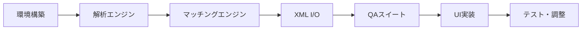

# MVP実装タスク（更新版）
Version: v2.0
Date: 2025-08-22
Status: Updated with New Design Principles

## 概要

AutoEditTATEのMVP実装に向けた具体的なタスクリスト。今回の設計議論で決定した以下の原則を反映：
- 相対的ダイナミズム原則（すべての解析値は楽曲・素材内での相対値）
- 時間軸別マッチング戦略（0-3秒、3-10秒、10-30秒、30-50秒、50-60秒）
- 学習ベース編集システムの基盤
- 柔軟なスコアリング（提案であって命令ではない）

## Phase 1: 基礎実装（3週間）

### 1.1 プロジェクト基盤

#### タスク1: 開発環境セットアップ
```yaml
deliverables:
  - Electron + React + TypeScript構成
  - モノレポ構造（packages/）
  - ローカルQAスイート設定
  
acceptance_criteria:
  - npm run dev で起動
  - npm run build でビルド成功
  - QAスイートがローカルで実行可能
  
priority: 🔴 必須
estimated_hours: 16
```

#### タスク2: 設定管理システム
```yaml
deliverables:
  - config/matching-segments.yaml（時間軸別設定）
  - config/analysis-settings.yaml（解析パラメータ）
  - 設定ローダー実装
  
acceptance_criteria:
  - 外部設定ファイルで調整可能
  - バリデーション機能
  - ホットリロード対応（開発時）
  
priority: 🔴 必須
estimated_hours: 8
```

### 1.2 解析エンジン基礎

#### タスク3: 音楽解析エンジン（相対的ダイナミズム対応）
```yaml
deliverables:
  - packages/analysis/music/MusicAnalyzer.ts
  - 相対値変換ロジック
  - 編集点スコアリング
  
implementation:
  - BPM検出（参考値）
  - ビート/オンセット検出
  - 相対的強度計算（0-1スケール）
  - 編集点候補の抽出（confidence + flexibility）
  
acceptance_criteria:
  - すべての値が楽曲内相対値として出力
  - 編集点にスコアと許容範囲を付与
  - テストファイルで動作確認
  
priority: 🔴 必須
estimated_hours: 24
```

#### タスク4: 映像解析エンジン（実践的判断）
```yaml
deliverables:
  - packages/analysis/video/VideoAnalyzer.ts
  - ショット使用可能性判定
  - 30%変化の法則実装
  
implementation:
  - ショット境界検出
  - 使用可能時間の判定（1秒から使用可、4秒で安定）
  - ヒーローショット判定（エッジ複雑性）
  - カット間遷移品質評価
  
acceptance_criteria:
  - 30%変化の法則でカット評価
  - 同ポジ同サイズの警告
  - 音楽との相性スコア出力
  
priority: 🔴 必須
estimated_hours: 24
```

#### タスク5: 歌詞解析エンジン（音楽統合）
```yaml
deliverables:
  - packages/analysis/lyrics/LyricsAnalyzer.ts
  - 音楽・歌詞統合解析
  
implementation:
  - ユーザー入力歌詞の処理
  - タイミング同期
  - フック/サビ検出
  - リップシンク可能性評価
  
acceptance_criteria:
  - 歌詞がない場合も動作
  - 音楽構造との相関出力
  - 字幕タイミング生成
  
priority: 🟡 高優先
estimated_hours: 16
```

## Phase 2: マッチングエンジン（2週間）

### 2.1 時間軸別マッチング

#### タスク6: TimeBasedMatchingEngine実装
```yaml
deliverables:
  - packages/matching/TimeBasedMatchingEngine.ts
  - セグメント別戦略適用
  
implementation:
  opening (0-3s):
    weights: {visual: 0.5, sync: 0.2}
    strategy: "ヒーローショット優先"
  
  development (3-10s):
    weights: {sync: 0.4, visual: 0.3}
    strategy: "リズム同期"
  
  middle (10-30s):
    weights: {semantic: 0.35, sync: 0.25}
    strategy: "ストーリー展開"
  
  climax (30-50s):
    weights: {sync: 0.4, visual: 0.35}
    strategy: "感情ピーク"
  
  ending (50-60s):
    weights: {stability: 0.35, visual: 0.3}
    strategy: "ループ準備"
  
acceptance_criteria:
  - セグメントごとに異なる重み適用
  - 音楽構造での動的調整
  - 設定ファイルで調整可能
  
priority: 🔴 必須
estimated_hours: 20
```

#### タスク7: 3パターン統合
```yaml
deliverables:
  - IntegratedMatchingEngine.ts
  - パターン別オーバーライド
  
implementation:
  - dynamic_cut: 攻撃的な冒頭、高速カット
  - narrative_flow: じっくり構築、ストーリー重視
  - hybrid_balance: セグメントごとに最適化
  
acceptance_criteria:
  - 既存の3パターンと統合
  - セグメント戦略の上書き可能
  
priority: 🔴 必須
estimated_hours: 12
```

### 2.2 統合処理

#### タスク8: 中間表現層（IR）実装
```yaml
deliverables:
  - packages/core/ir/IntermediateRepresentation.ts
  - 統合タイムライン生成
  
implementation:
  - 音楽・映像・歌詞の統一タイムライン
  - セグメント単位での特徴量保持
  - 統合スコア計算
  
acceptance_criteria:
  - 100-500ms単位でセグメント化
  - 各解析結果の統合
  - キャッシング機能
  
priority: 🔴 必須
estimated_hours: 16
```

## Phase 3: XML入出力（2週間）

### 3.1 入力処理

#### タスク9: Premiere XML パーサー
```yaml
deliverables:
  - packages/io/xml/PremiereXMLParser.ts
  - 素材情報抽出
  
implementation:
  - XMLパース
  - In/Out点抽出
  - 素材パス解決
  - メタデータ抽出
  
acceptance_criteria:
  - Premiere XML読み込み成功
  - 素材情報の正確な抽出
  - エラーハンドリング
  
priority: 🔴 必須
estimated_hours: 12
```

### 3.2 出力処理

#### タスク10: XML生成エンジン
```yaml
deliverables:
  - packages/io/xml/XMLGenerator.ts
  - explain.json生成
  
implementation:
  - FCPXML/Premiere XML生成
  - タイムコード正確性保証
  - explain.json同時出力
  
acceptance_criteria:
  - NLE互換性確認
  - explain.jsonに全判断根拠記載
  - aggregateConfidence ≥ 0.88
  
priority: 🔴 必須
estimated_hours: 16
```

## Phase 4: QAスイートと品質保証（1週間）

### 4.1 QAスイート実装

#### タスク11: バリデーター群
```yaml
deliverables:
  - packages/qa/validators/*.ts
  - 9項目の検証器
  
implementation:
  - validateXMLStructure
  - validateTimecodes
  - validateClipReferences
  - validateMusicSync
  - validate30PercentRule（新規）
  - validateSegmentTransitions（新規）
  
acceptance_criteria:
  - すべての検証器が動作
  - error_report.json生成
  - 詳細なエラーメッセージ
  
priority: 🔴 必須
estimated_hours: 16
```

## Phase 5: UI実装（2週間）

### 5.1 基本UI

#### タスク12: メインUI実装
```yaml
deliverables:
  - app/renderer/components/*.tsx
  - 基本的な画面遷移
  
implementation:
  - 素材インポート画面
  - 処理進捗表示
  - 結果確認画面（3パターン比較）
  - explain.jsonビューアー
  
acceptance_criteria:
  - ファイル選択機能
  - リアルタイム進捗表示
  - エラー表示
  
priority: 🟡 高優先
estimated_hours: 24
```

## Phase 6: 評価システム基礎（MVP後・準備のみ）

### 6.1 評価UI設計

#### タスク13: 評価システム基盤
```yaml
deliverables:
  - packages/evaluation/EvaluationSystem.ts（スケルトン）
  - 評価データスキーマ定義
  
implementation:
  - 5つ星評価 + コメント入力
  - セグメント別評価
  - LLM解析準備（インターフェースのみ）
  
acceptance_criteria:
  - データ構造の定義完了
  - 将来の拡張性確保
  
priority: 🟢 中優先
estimated_hours: 8
```

## テスト計画

### ユニットテスト
```yaml
coverage_target: 70%
priority_areas:
  - 相対値変換ロジック
  - 30%変化の法則
  - セグメント判定
  - スコア計算
```

### 統合テスト
```yaml
test_scenarios:
  - 60秒動画の完全処理
  - 3パターン生成
  - explain.json検証
  - XML往復テスト
```

### パフォーマンステスト
```yaml
requirements:
  - 60秒動画: < 5分処理
  - メモリ使用: < 2GB
  - CPU使用率: < 80%
```

## 実装順序（推奨）



## リスクと対策

### 技術的リスク
| リスク | 影響 | 対策 |
|--------|------|------|
| 音楽同期精度 | 高 | flexibilityパラメータで調整 |
| 処理速度 | 中 | キャッシング、並列処理 |
| メモリ使用量 | 中 | ストリーミング処理 |

### スケジュールリスク
| リスク | 影響 | 対策 |
|--------|------|------|
| 解析精度不足 | 高 | 早期プロトタイプで検証 |
| UI実装遅延 | 低 | CLI版を先行実装 |

## 成功基準

### MVP成功条件
- [ ] Premiere XMLから60秒動画を処理
- [ ] 3パターン生成成功
- [ ] explain.json出力
- [ ] aggregateConfidence ≥ 0.88
- [ ] 処理時間 < 5分

### 品質基準
- [ ] クラッシュなし
- [ ] メモリリークなし
- [ ] 再現可能な出力

## まとめ

本タスクリストは、今回の設計議論で決定した新しい原則を反映している：

1. **相対的ダイナミズム**: すべての解析値を楽曲・素材内での相対値として扱う
2. **時間軸別戦略**: セグメントごとに異なる編集方針を適用
3. **柔軟なスコアリング**: 提案の強さとして扱い、絶対的な命令としない
4. **実践的判断**: 技術的数値を編集判断に変換

実装は段階的に進め、各フェーズで動作確認を行いながら進める。

---
*本ドキュメントは実装の進捗に応じて更新される。*